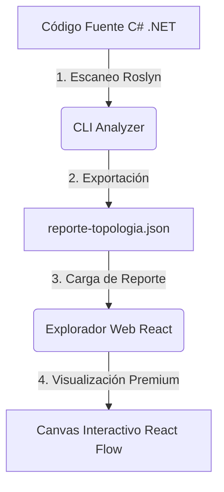

# Message Flow Explorer 🔍🌐

[](https://github.com/dadeleac/message-flow-explorer/actions/workflows/ci.yml)
[](https://dotnet.microsoft.com/)
[](https://react.dev/)
[](https://vite.dev/)
[](https://masstransit.io/)
[](LICENSE)

**Message Flow Explorer** es una herramienta avanzada de análisis estático y visualización interactiva diseñada para cartografiar y comprender los flujos de mensajería distribuida en soluciones de .NET basadas en **MassTransit**. 

Analiza tu código fuente en C# usando **Roslyn** y genera automáticamente un mapa interactivo que ilustra las relaciones exactas entre tus Publicadores, Consumidores, Sagas (Máquinas de Estado) y Actividades de Routing Slip.

> **¿Qué pasa después de publicar un mensaje?**
> Con Message Flow Explorer, la respuesta es visual, instantánea y documentable.

---

## 🎨 Características Destacadas

* 🚀 **Análisis Estático con Roslyn (Cero Dependencias en Runtime)**: Escanea el código fuente recursivamente buscando firmas semánticas de MassTransit (Publish, Send, Request, Respond, IConsumer, MassTransitStateMachine, IActivity) en tiempo de compilación.
* 🗺️ **Lienzo de Grafo Inteligente de 4 Columnas**: Organiza la topología de tu sistema distribuido de izquierda a derecha (Publicadores $\rightarrow$ Contratos de Mensajes $\rightarrow$ Sagas / Orquestadores $\rightarrow$ Consumidores y Actividades finales).
* ⚡ **Análisis de Flujos Activos (Path Analysis)**: Haz clic en cualquier nodo para resaltar instantáneamente toda su ruta lógica (upstream y downstream) y atenuar el resto del mapa para eliminar el ruido visual.
* 📦 **Agrupamiento por Proyecto / Microservicio**: Envuelve de forma visual los componentes que pertenezcan al mismo proyecto `.csproj` o microservicio en subgrafos delimitados para entender la delimitación de contextos.
* ⚠️ **Detección de Mensajes Huérfanos**: Identifica automáticamente advertencias de arquitectura, como contratos de mensajes publicados que nadie consume o consumidores esperando mensajes que nadie publica.
* 💻 **Previsualizador de Código C# Integrado**: Inspecciona el código de la invocación de MassTransit (para publicadores) o el cuerpo de la clase (para consumidores/sagas) directamente desde el panel derecho sin salir de la herramienta, con coloreado de sintaxis nativo y auto-sangría.
* 📝 **Copiar Diagramas a Mermaid**: Genera y copia al portapapeles diagramas de secuencia en código Mermaid con un solo clic para pegarlos directamente en tu documentación de Markdown o Wikis corporativas.

---

## 🏗️ ¿Cómo Funciona?

El sistema se divide en dos componentes desacoplados para máxima flexibilidad:



1. **`Analyzer (C#)`**: Una herramienta de CLI ultrarrápida que analiza tu código de manera estática y genera un modelo de grafo serializado en formato JSON.
2. **`Web Explorer (React + React Flow)`**: Un portal web de alto rendimiento y diseño oscuro premium que renderiza el JSON como un mapa interactivo.

---

## 🚀 Inicio Rápido: Modo Autónomo (Recomendado ⚡)

La forma más sencilla de utilizar **Message Flow Explorer** es compilarlo una vez y ejecutarlo de manera autónoma. Esto iniciará el **servidor web embebido** en el ejecutable, escaneará la carpeta indicada y abrirá automáticamente tu navegador sin necesidad de levantar un servidor Node/npm por separado.

### 1. Compilar todo el proyecto (Frontend + CLI)
```bash
# 1. Compilar el frontend en producción
npm run build --prefix web

# 2. Compilar el CLI (esto incrustará el frontend automáticamente)
dotnet build src/MessageFlowExplorer.Cli/MessageFlowExplorer.Cli.csproj --configuration Release
```

### 2. Ejecutar y Servir
Ejecuta el CLI apuntando a la carpeta de tu monorepo/solución y añade la bandera `-s` o `--serve`:
```bash
dotnet run --project src/MessageFlowExplorer.Cli/MessageFlowExplorer.Cli.csproj --configuration Release -- -i sample -s
```
*Esto escaneará el código de la carpeta `sample/`, guardará el reporte JSON y abrirá tu navegador predeterminado en `http://localhost:5000` con el lienzo interactivo.*

---

## 📦 Distribución como Ejecutable Autónomo (para equipos)

Para repartir la herramienta a un equipo **sin que tengan que instalar nada** (ni Node, ni el SDK de .NET para *ejecutarla*), genera ejecutables *self-contained* que ya incluyen el runtime de .NET y el frontend embebido:

```bash
# Genera carpetas + .zip por plataforma en dist-release/
./scripts/publish.sh                 # todas (osx-arm64, osx-x64, win-x64, linux-x64)
./scripts/publish.sh win-x64         # solo una
```

Cada `.zip` contiene una carpeta autónoma. El usuario final solo descomprime y ejecuta:

```bash
# macOS / Linux
./mfe -i /ruta/al/monorepo -s

# Windows
mfe.exe -i C:\ruta\al\monorepo -s
```

> **Nota importante sobre el análisis:** el ejecutable es autónomo para *correr*, pero el **análisis de alta fidelidad con MSBuild** (que resuelve referencias reales y enlaza mensajes con precisión entre microservicios) requiere que la máquina destino tenga instalado el **.NET SDK** — algo que cualquier desarrollador .NET ya tiene. Si no hay SDK, la herramienta sigue funcionando en modo de análisis sintáctico (menor precisión). Por eso **NO** se usa publicación *single-file*: Roslyn necesita su proceso auxiliar `BuildHost`, que viaja dentro de la carpeta.

---

## 🔧 Desarrollo Local (Doble Modo)

Si deseas realizar modificaciones en la interfaz de React con recarga en caliente (Hot Reloading) mientras trabajas en el analizador:

### 1. Generar Reporte de Muestra
```bash
dotnet run --project src/MessageFlowExplorer.Cli/MessageFlowExplorer.Cli.csproj -- -i sample -o web/src/sample-output.json
```

### 2. Iniciar el Frontend en Desarrollo
```bash
# Ir al directorio del frontend e instalar dependencias
cd web && npm install

# Levantar el servidor de desarrollo de Vite
npm run dev
```
Abre [http://localhost:5173](http://localhost:5173) en tu navegador. El frontend detectará que el servidor C# está apagado y usará automáticamente el archivo `sample-output.json` local.


---

## 🛠️ Estructura del Proyecto

* **`src/MessageFlowExplorer.Core`**: Definición del modelo del dominio común y contratos de exportación.
* **`src/MessageFlowExplorer.Analyzer`**: Lógica de análisis estático con el `CSharpSyntaxWalker`. Si encuentra archivos `.csproj` carga la solución real con **MSBuildWorkspace** (resolviendo todas las referencias de NuGet/proyecto, p. ej. MassTransit y MediatR), lo que permite resolver los tipos por su nombre totalmente cualificado y enlazar mensajes con precisión entre microservicios. Si no hay proyectos, recurre a un análisis sintáctico de archivos `.cs` sueltos.
* **`src/MessageFlowExplorer.Cli`**: Punto de entrada de línea de comandos.
* **`tests/MessageFlowExplorer.Tests`**: Pruebas unitarias completas de análisis de patrones y flujos.
* **`web/`**: Portal interactivo construido con React, React Flow (Vite, Lucide React, Vanilla CSS).

---

## 📄 Licencia

Este proyecto está bajo la Licencia MIT - ver el archivo [LICENSE](LICENSE) para más detalles.

---

*Desarrollado con ❤️ por **David De Leon Acosta** para optimizar la documentación de arquitecturas orientadas a eventos en entornos reales de producción.*
